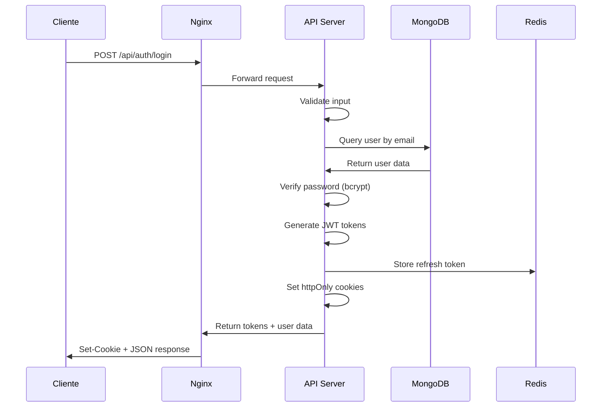
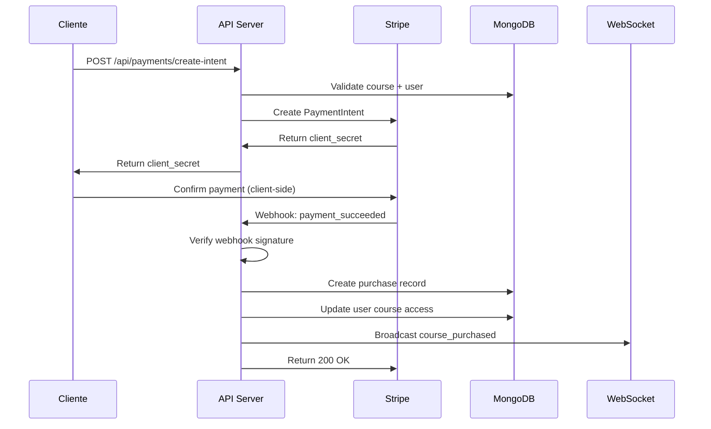
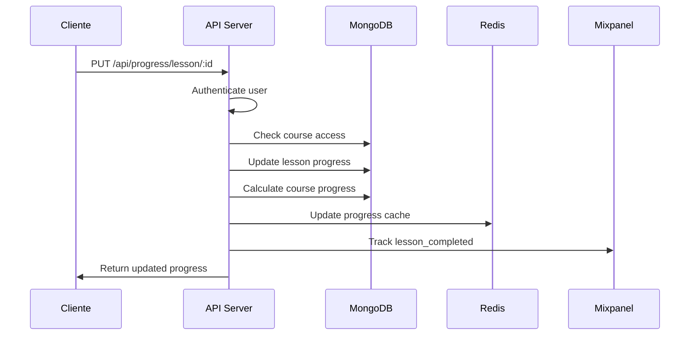

# 🏗️ ARQUITECTURA DEL SISTEMA
# PARNASSUS ACADEMY BACKEND - Documentación de Arquitectura

## 📊 VISIÓN GENERAL DEL SISTEMA

### Arquitectura de Alto Nivel
```
┌─────────────────────────────────────────────────────────────────┐
│                         INTERNET                                 │
└─────────────────────┬───────────────────────────────────────────┘
                      │
┌─────────────────────▼───────────────────────────────────────────┐
│                  CLOUDFLARE / CDN                               │
│              SSL Termination + DDoS Protection                  │
└─────────────────────┬───────────────────────────────────────────┘
                      │
┌─────────────────────▼───────────────────────────────────────────┐
│                 NGINX LOAD BALANCER                             │
│       Rate Limiting + SSL + Static Files + Compression          │
└─────────────────────┬───────────────────────────────────────────┘
                      │
        ┌─────────────┼─────────────┐
        │             │             │
        ▼             ▼             ▼
┌──────────────┐ ┌──────────────┐ ┌──────────────┐
│   NODE.JS    │ │   NODE.JS    │ │   NODE.JS    │
│  INSTANCE 1  │ │  INSTANCE 2  │ │  INSTANCE 3  │
│              │ │              │ │              │
│ Express.js   │ │ Express.js   │ │ Express.js   │
│ Socket.io    │ │ Socket.io    │ │ Socket.io    │
│ JWT Auth     │ │ JWT Auth     │ │ JWT Auth     │
└──────┬───────┘ └──────┬───────┘ └──────┬───────┘
       │                │                │
       └────────────────┼────────────────┘
                        │
      ┌─────────────────▼─────────────────┐
      │           SHARED SERVICES          │
      │                                   │
      │  ┌─────────────────────────────┐  │
      │  │        MONGODB              │  │
      │  │     (Replica Set)           │  │
      │  │                             │  │
      │  │  ┌─────────┐ ┌─────────┐   │  │
      │  │  │Primary  │ │Secondary│   │  │
      │  │  │         │ │         │   │  │
      │  │  └─────────┘ └─────────┘   │  │
      │  └─────────────────────────────┘  │
      │                                   │
      │  ┌─────────────────────────────┐  │
      │  │         REDIS               │  │
      │  │    (Session Store +         │  │
      │  │     Cache Layer)            │  │
      │  └─────────────────────────────┘  │
      │                                   │
      │  ┌─────────────────────────────┐  │
      │  │      EXTERNAL APIS          │  │
      │  │                             │  │
      │  │  • Stripe (Payments)        │  │
      │  │  • SendGrid (Email)         │  │
      │  │  • Mixpanel (Analytics)     │  │
      │  │  • AWS S3 (File Storage)    │  │
      │  └─────────────────────────────┘  │
      └───────────────────────────────────┘
```

---

## 🎯 ARQUITECTURA DE APLICACIÓN

### Estructura de Capas
```
┌─────────────────────────────────────────────────────────────────┐
│                      PRESENTATION LAYER                         │
├─────────────────────────────────────────────────────────────────┤
│                                                                 │
│  ┌──────────────┐  ┌──────────────┐  ┌──────────────┐          │
│  │    ROUTES    │  │ MIDDLEWARES  │  │  WEBSOCKETS  │          │
│  │              │  │              │  │              │          │
│  │ • /api/auth  │  │ • authJWT    │  │ • Realtime   │          │
│  │ • /api/user  │  │ • rateLimiter│  │ • Broadcast  │          │
│  │ • /api/course│  │ • validator  │  │ • Rooms      │          │
│  │ • /api/pay   │  │ • security   │  │              │          │
│  │ • /health    │  │ • cors       │  │              │          │
│  └──────────────┘  └──────────────┘  └──────────────┘          │
│                                                                 │
├─────────────────────────────────────────────────────────────────┤
│                      BUSINESS LOGIC LAYER                       │
├─────────────────────────────────────────────────────────────────┤
│                                                                 │
│  ┌──────────────┐  ┌──────────────┐  ┌──────────────┐          │
│  │ CONTROLLERS  │  │   SERVICES   │  │   UTILITIES  │          │
│  │              │  │              │  │              │          │
│  │ • authCtrl   │  │ • authSvc    │  │ • emailUtil  │          │
│  │ • userCtrl   │  │ • userSvc    │  │ • cryptoUtil │          │
│  │ • courseCtrl │  │ • courseSvc  │  │ • fileUtil   │          │
│  │ • payCtrl    │  │ • paySvc     │  │ • cacheUtil  │          │
│  │ • adminCtrl  │  │ • adminSvc   │  │ • validUtil  │          │
│  └──────────────┘  └──────────────┘  └──────────────┘          │
│                                                                 │
├─────────────────────────────────────────────────────────────────┤
│                        DATA ACCESS LAYER                        │
├─────────────────────────────────────────────────────────────────┤
│                                                                 │
│  ┌──────────────┐  ┌──────────────┐  ┌──────────────┐          │
│  │ REPOSITORIES │  │    MODELS    │  │   DATABASE   │          │
│  │              │  │              │  │              │          │
│  │ • userRepo   │  │ • User       │  │ • MongoDB    │          │
│  │ • courseRepo │  │ • Course     │  │ • Mongoose   │          │
│  │ • payRepo    │  │ • Purchase   │  │ • Indexes    │          │
│  │ • cacheRepo  │  │ • Progress   │  │ • Validation │          │
│  │              │  │ • Analytics  │  │ • Migrations │          │
│  └──────────────┘  └──────────────┘  └──────────────┘          │
│                                                                 │
└─────────────────────────────────────────────────────────────────┘
```

---

## 🔄 FLUJO DE DATOS

### Flujo de Autenticación


### Flujo de Compra


### Flujo de Progreso del Curso


---

## 🛡️ ARQUITECTURA DE SEGURIDAD

### Capas de Seguridad
```
┌─────────────────────────────────────────────────────────────────┐
│                      PERIMETER SECURITY                         │
├─────────────────────────────────────────────────────────────────┤
│                                                                 │
│  ┌─────────────┐ ┌─────────────┐ ┌─────────────┐               │
│  │   FIREWALL  │ │    DDoS     │ │  GEO-BLOCK  │               │
│  │             │ │ PROTECTION  │ │             │               │
│  │ • Port 443  │ │             │ │ • Whitelist │               │
│  │ • Port 80   │ │ • Rate Limit│ │ • Blacklist │               │
│  │ • Port 22   │ │ • IP Filter │ │ • Suspicious│               │
│  └─────────────┘ └─────────────┘ └─────────────┘               │
│                                                                 │
├─────────────────────────────────────────────────────────────────┤
│                    APPLICATION SECURITY                         │
├─────────────────────────────────────────────────────────────────┤
│                                                                 │
│  ┌─────────────┐ ┌─────────────┐ ┌─────────────┐               │
│  │ RATE LIMITS │ │    INPUT     │ │    AUTH      │               │
│  │             │ │ VALIDATION  │ │              │               │
│  │ • API: 100/15m│ │             │ │ • JWT       │               │
│  │ • Auth: 5/15m │ │ • Joi Schema│ │ • 2FA       │               │
│  │ • Pay: 3/5m  │ │ • Sanitize  │ │ • RBAC      │               │
│  └─────────────┘ └─────────────┘ └─────────────┘               │
│                                                                 │
├─────────────────────────────────────────────────────────────────┤
│                      DATA SECURITY                              │
├─────────────────────────────────────────────────────────────────┤
│                                                                 │
│  ┌─────────────┐ ┌─────────────┐ ┌─────────────┐               │
│  │ ENCRYPTION  │ │   HASHING   │ │  DATABASE   │               │
│  │             │ │             │ │  SECURITY   │               │
│  │ • TLS 1.3   │ │ • bcrypt    │ │             │               │
│  │ • AES-256   │ │ • Passwords │ │ • AuthN     │               │
│  │ • At Rest   │ │ • Sensitive │ │ • AuthZ     │               │
│  └─────────────┘ └─────────────┘ └─────────────┘               │
│                                                                 │
└─────────────────────────────────────────────────────────────────┘
```

---

## 📊 MODELO DE DATOS

### Esquema de Base de Datos
```
┌─────────────────────────────────────────────────────────────────┐
│                           USERS                                 │
├─────────────────────────────────────────────────────────────────┤
│ _id: ObjectId                                                   │
│ email: String (unique, indexed)                                 │
│ username: String (unique)                                       │
│ password: String (hashed)                                       │
│ firstName: String                                               │
│ lastName: String                                                │
│ role: Enum [student, teacher, admin]                           │
│ isEmailVerified: Boolean                                        │
│ twoFactorSecret: String                                         │
│ profileImage: String                                            │
│ preferences: Object                                             │
│ lastLoginAt: Date                                               │
│ createdAt: Date                                                 │
│ updatedAt: Date                                                 │
└─────────────────────────────────────────────────────────────────┘
                              │
                              │ 1:N
                              ▼
┌─────────────────────────────────────────────────────────────────┐
│                          COURSES                                │
├─────────────────────────────────────────────────────────────────┤
│ _id: ObjectId                                                   │
│ title: String                                                   │
│ slug: String (unique, indexed)                                  │
│ description: String                                             │
│ teacher: ObjectId → Users                                       │
│ category: String (indexed)                                      │
│ level: Enum [beginner, intermediate, advanced] (indexed)       │
│ price: Number                                                   │
│ currency: String                                                │
│ isPublished: Boolean (indexed)                                  │
│ thumbnail: String                                               │
│ totalLessons: Number                                            │
│ estimatedDuration: Number                                       │
│ tags: [String]                                                  │
│ requirements: [String]                                          │
│ whatWillLearn: [String]                                         │
│ createdAt: Date (indexed)                                       │
│ updatedAt: Date                                                 │
└─────────────────────────────────────────────────────────────────┘
              │                              │
              │ 1:N                          │ 1:N
              ▼                              ▼
┌──────────────────────────┐    ┌──────────────────────────┐
│        LESSONS           │    │       PURCHASES          │
├──────────────────────────┤    ├──────────────────────────┤
│ _id: ObjectId            │    │ _id: ObjectId            │
│ courseId: ObjectId       │    │ userId: ObjectId         │
│ title: String            │    │ courseId: ObjectId       │
│ content: String          │    │ amount: Number           │
│ videoUrl: String         │    │ currency: String         │
│ duration: Number         │    │ stripePaymentIntentId    │
│ order: Number            │    │ status: Enum             │
│ isPublished: Boolean     │    │ purchasedAt: Date        │
│ createdAt: Date          │    │                          │
│ updatedAt: Date          │    │                          │
└──────────────────────────┘    └──────────────────────────┘
              │                              │
              │ 1:N                          │
              ▼                              │
┌──────────────────────────┐                 │
│       PROGRESS           │                 │
├──────────────────────────┤                 │
│ _id: ObjectId            │                 │
│ userId: ObjectId         │◄────────────────┘
│ courseId: ObjectId       │
│ lessonId: ObjectId       │
│ status: Enum             │
│ timeSpent: Number        │
│ completedAt: Date        │
│ createdAt: Date          │
│ updatedAt: Date          │
└──────────────────────────┘
```

### Índices de Base de Datos
```javascript
// Índices críticos para performance
db.users.createIndex({ email: 1 }, { unique: true })
db.users.createIndex({ username: 1 }, { unique: true })
db.users.createIndex({ role: 1, createdAt: -1 })

db.courses.createIndex({ slug: 1 }, { unique: true })
db.courses.createIndex({ teacher: 1 })
db.courses.createIndex({ category: 1, level: 1 })
db.courses.createIndex({ isPublished: 1, createdAt: -1 })
db.courses.createIndex({ 
  title: "text", 
  description: "text", 
  tags: "text" 
})

db.purchases.createIndex({ userId: 1, courseId: 1 })
db.purchases.createIndex({ stripePaymentIntentId: 1 }, { unique: true })
db.purchases.createIndex({ status: 1, purchasedAt: -1 })

db.progress.createIndex({ userId: 1, lessonId: 1 }, { unique: true })
db.progress.createIndex({ userId: 1, courseId: 1 })
db.progress.createIndex({ courseId: 1, status: 1 })

// TTL para tokens expirados
db.refresh_tokens.createIndex({ expiresAt: 1 }, { expireAfterSeconds: 0 })
```

---

## 🔄 PATRONES DE DISEÑO

### Repository Pattern
```javascript
// Base Repository
class BaseRepository {
  constructor(model) {
    this.model = model;
  }

  async findById(id) {
    return await this.model.findById(id);
  }

  async findOne(query) {
    return await this.model.findOne(query);
  }

  async find(query, options = {}) {
    return await this.model.find(query, null, options);
  }

  async create(data) {
    return await this.model.create(data);
  }

  async update(id, data) {
    return await this.model.findByIdAndUpdate(id, data, { new: true });
  }

  async delete(id) {
    return await this.model.findByIdAndDelete(id);
  }
}

// Specific Repository
class UserRepository extends BaseRepository {
  constructor() {
    super(User);
  }

  async findByEmail(email) {
    return await this.model.findOne({ email });
  }

  async findActiveTeachers() {
    return await this.model.find({ 
      role: 'teacher', 
      isActive: true 
    });
  }
}
```

### Service Layer Pattern
```javascript
class UserService {
  constructor(userRepo, emailService) {
    this.userRepo = userRepo;
    this.emailService = emailService;
  }

  async registerUser(userData) {
    // Validación
    await this.validateUserData(userData);
    
    // Hash password
    const hashedPassword = await bcrypt.hash(userData.password, 12);
    
    // Crear usuario
    const user = await this.userRepo.create({
      ...userData,
      password: hashedPassword
    });

    // Enviar email de confirmación
    await this.emailService.sendWelcomeEmail(user.email);

    return user;
  }

  async validateUserData(userData) {
    if (await this.userRepo.findByEmail(userData.email)) {
      throw new Error('Email already exists');
    }
  }
}
```

### Middleware Pattern
```javascript
// Authentication Middleware
const authMiddleware = (req, res, next) => {
  try {
    const token = req.cookies.accessToken || 
                  req.headers.authorization?.split(' ')[1];
    
    if (!token) {
      return res.status(401).json({ error: 'No token provided' });
    }

    const decoded = jwt.verify(token, process.env.JWT_SECRET);
    req.user = decoded;
    next();
  } catch (error) {
    return res.status(401).json({ error: 'Invalid token' });
  }
};

// Authorization Middleware
const authorize = (roles) => (req, res, next) => {
  if (!roles.includes(req.user.role)) {
    return res.status(403).json({ error: 'Insufficient permissions' });
  }
  next();
};
```

---

## 📈 ESCALABILIDAD

### Estrategias de Escalabilidad Horizontal
```
┌─────────────────────────────────────────────────────────────────┐
│                    LOAD BALANCER LAYER                          │
├─────────────────────────────────────────────────────────────────┤
│                                                                 │
│  ┌─────────────┐ ┌─────────────┐ ┌─────────────┐               │
│  │   NGINX     │ │ CLOUDFLARE  │ │   AWS ALB   │               │
│  │             │ │             │ │             │               │
│  │ • Round     │ │ • Global    │ │ • Health    │               │
│  │   Robin     │ │   CDN       │ │   Checks    │               │
│  │ • Health    │ │ • DDoS      │ │ • SSL       │               │
│  │   Check     │ │   Protection│ │   Offload   │               │
│  └─────────────┘ └─────────────┘ └─────────────┘               │
│                                                                 │
├─────────────────────────────────────────────────────────────────┤
│                   APPLICATION LAYER                             │
├─────────────────────────────────────────────────────────────────┤
│                                                                 │
│  ┌─────────────┐ ┌─────────────┐ ┌─────────────┐               │
│  │  NODE.JS    │ │  NODE.JS    │ │  NODE.JS    │               │
│  │ INSTANCE 1  │ │ INSTANCE 2  │ │ INSTANCE N  │               │
│  │             │ │             │ │             │               │
│  │ • Stateless │ │ • Stateless │ │ • Stateless │               │
│  │ • Auto-     │ │ • Auto-     │ │ • Auto-     │               │
│  │   Scale     │ │   Scale     │ │   Scale     │               │
│  └─────────────┘ └─────────────┘ └─────────────┘               │
│                                                                 │
├─────────────────────────────────────────────────────────────────┤
│                     DATA LAYER                                  │
├─────────────────────────────────────────────────────────────────┤
│                                                                 │
│  ┌─────────────┐ ┌─────────────┐ ┌─────────────┐               │
│  │   MONGODB   │ │    REDIS    │ │    CDN      │               │
│  │ REPLICA SET │ │   CLUSTER   │ │  (STATIC)   │               │
│  │             │ │             │ │             │               │
│  │ • Primary   │ │ • Session   │ │ • Images    │               │
│  │ • Secondary │ │ • Cache     │ │ • Videos    │               │
│  │ • Arbiter   │ │ • Pub/Sub   │ │ • CSS/JS    │               │
│  └─────────────┘ └─────────────┘ └─────────────┘               │
│                                                                 │
└─────────────────────────────────────────────────────────────────┘
```

### Auto-scaling Configuration
```yaml
# Kubernetes Horizontal Pod Autoscaler
apiVersion: autoscaling/v2
kind: HorizontalPodAutoscaler
metadata:
  name: parnassus-api-hpa
spec:
  scaleTargetRef:
    apiVersion: apps/v1
    kind: Deployment
    name: parnassus-api
  minReplicas: 3
  maxReplicas: 20
  metrics:
  - type: Resource
    resource:
      name: cpu
      target:
        type: Utilization
        averageUtilization: 70
  - type: Resource
    resource:
      name: memory
      target:
        type: Utilization
        averageUtilization: 80
```

---

## 🔍 MONITOREO Y OBSERVABILIDAD

### Stack de Monitoreo
```
┌─────────────────────────────────────────────────────────────────┐
│                       METRICS COLLECTION                        │
├─────────────────────────────────────────────────────────────────┤
│                                                                 │
│  ┌─────────────┐ ┌─────────────┐ ┌─────────────┐               │
│  │ APPLICATION │ │  SYSTEM     │ │  BUSINESS   │               │
│  │   METRICS   │ │  METRICS    │ │   METRICS   │               │
│  │             │ │             │ │             │               │
│  │ • Response  │ │ • CPU       │ │ • Users     │               │
│  │   Time      │ │ • Memory    │ │ • Courses   │               │
│  │ • Error     │ │ • Disk      │ │ • Revenue   │               │
│  │   Rate      │ │ • Network   │ │ • Engagement│               │
│  └─────────────┘ └─────────────┘ └─────────────┘               │
│                                                                 │
├─────────────────────────────────────────────────────────────────┤
│                      LOGGING PIPELINE                           │
├─────────────────────────────────────────────────────────────────┤
│                                                                 │
│  ┌─────────────┐ ┌─────────────┐ ┌─────────────┐               │
│  │   WINSTON   │ │ FILEBEAT/   │ │ ELASTICSEARCH│               │
│  │   LOGGER    │ │  FLUENTD    │ │   CLUSTER    │               │
│  │             │ │             │ │             │               │
│  │ • Structured│ │ • Log       │ │ • Search    │               │
│  │   JSON      │ │   Shipping  │ │ • Analysis  │               │
│  │ • Multiple  │ │ • Parse     │ │ • Alerting  │               │
│  │   Levels    │ │ • Filter    │ │             │               │
│  └─────────────┘ └─────────────┘ └─────────────┘               │
│                                                                 │
├─────────────────────────────────────────────────────────────────┤
│                    ALERTING & DASHBOARD                         │
├─────────────────────────────────────────────────────────────────┤
│                                                                 │
│  ┌─────────────┐ ┌─────────────┐ ┌─────────────┐               │
│  │   GRAFANA   │ │ PROMETHEUS  │ │   ALERTMANAGER│               │
│  │  DASHBOARD  │ │   ALERTS    │ │              │               │
│  │             │ │             │ │ • Slack      │               │
│  │ • Real-time │ │ • Threshold │ │ • Email      │               │
│  │ • Historical│ │ • Anomaly   │ │ • PagerDuty  │               │
│  │ • Custom    │ │ • SLA       │ │ • SMS        │               │
│  │   Views     │ │   Breach    │ │              │               │
│  └─────────────┘ └─────────────┘ └─────────────┘               │
│                                                                 │
└─────────────────────────────────────────────────────────────────┘
```

---

## 🚀 PERFORMANCE OPTIMIZATION

### Estrategias de Cache
```
┌─────────────────────────────────────────────────────────────────┐
│                        CACHE LAYERS                             │
├─────────────────────────────────────────────────────────────────┤
│                                                                 │
│  ┌─────────────┐ ┌─────────────┐ ┌─────────────┐               │
│  │   BROWSER   │ │     CDN     │ │  NGINX      │               │
│  │    CACHE    │ │    CACHE    │ │   CACHE     │               │
│  │             │ │             │ │             │               │
│  │ • Local     │ │ • Global    │ │ • Static    │               │
│  │   Storage   │ │   Edge      │ │   Files     │               │
│  │ • Session   │ │ • Images    │ │ • Gzip      │               │
│  │   Storage   │ │ • Videos    │ │ • Headers   │               │
│  └─────────────┘ └─────────────┘ └─────────────┘               │
│                                                                 │
│  ┌─────────────┐ ┌─────────────┐ ┌─────────────┐               │
│  │ APPLICATION │ │    REDIS    │ │  DATABASE   │               │
│  │    CACHE    │ │    CACHE    │ │   CACHE     │               │
│  │             │ │             │ │             │               │
│  │ • Memory    │ │ • Session   │ │ • Query     │               │
│  │   Cache     │ │   Store     │ │   Cache     │               │
│  │ • Response  │ │ • User      │ │ • Index     │               │
│  │   Cache     │ │   Cache     │ │   Cache     │               │
│  └─────────────┘ └─────────────┘ └─────────────┘               │
│                                                                 │
└─────────────────────────────────────────────────────────────────┘
```

### Database Query Optimization
```javascript
// Agregación optimizada para dashboard de administrador
const coursesAnalytics = await Course.aggregate([
  {
    $match: { 
      isPublished: true,
      createdAt: { $gte: startDate, $lte: endDate }
    }
  },
  {
    $lookup: {
      from: 'purchases',
      localField: '_id',
      foreignField: 'courseId',
      as: 'purchases'
    }
  },
  {
    $addFields: {
      totalSales: { $size: '$purchases' },
      revenue: { 
        $sum: '$purchases.amount' 
      }
    }
  },
  {
    $group: {
      _id: '$category',
      totalCourses: { $sum: 1 },
      totalSales: { $sum: '$totalSales' },
      totalRevenue: { $sum: '$revenue' },
      avgPrice: { $avg: '$price' }
    }
  },
  {
    $sort: { totalRevenue: -1 }
  }
]);

// Usar índices compuestos para queries complejas
db.courses.createIndex({ 
  isPublished: 1, 
  category: 1, 
  createdAt: -1 
});
```

---

## 🔄 CI/CD PIPELINE

### Pipeline Architecture
```
┌─────────────────────────────────────────────────────────────────┐
│                       SOURCE CONTROL                            │
├─────────────────────────────────────────────────────────────────┤
│                                                                 │
│                     GitHub Repository                           │
│                   (Feature Branches)                           │
│                                                                 │
└─────────────────────┬───────────────────────────────────────────┘
                      │ Push/PR
                      ▼
┌─────────────────────────────────────────────────────────────────┐
│                    CONTINUOUS INTEGRATION                       │
├─────────────────────────────────────────────────────────────────┤
│                                                                 │
│  ┌─────────────┐ ┌─────────────┐ ┌─────────────┐               │
│  │   LINTING   │ │   TESTING   │ │  SECURITY   │               │
│  │             │ │             │ │    SCAN     │               │
│  │ • ESLint    │ │ • Unit      │ │             │               │
│  │ • Prettier  │ │ • Integration│ │ • SAST      │               │
│  │ • Standards │ │ • E2E       │ │ • Deps      │               │
│  └─────────────┘ └─────────────┘ └─────────────┘               │
│                                                                 │
└─────────────────────┬───────────────────────────────────────────┘
                      │ Tests Pass
                      ▼
┌─────────────────────────────────────────────────────────────────┐
│                   CONTINUOUS DEPLOYMENT                         │
├─────────────────────────────────────────────────────────────────┤
│                                                                 │
│  ┌─────────────┐ ┌─────────────┐ ┌─────────────┐               │
│  │   BUILD     │ │   DEPLOY    │ │  MONITOR    │               │
│  │             │ │             │ │             │               │
│  │ • Docker    │ │ • Staging   │ │ • Health    │               │
│  │   Image     │ │ • Blue/     │ │   Check     │               │
│  │ • Push      │ │   Green     │ │ • Rollback  │               │
│  │   Registry  │ │ • Production│ │ • Alerts    │               │
│  └─────────────┘ └─────────────┘ └─────────────┘               │
│                                                                 │
└─────────────────────────────────────────────────────────────────┘
```

---

**Documentación de Arquitectura**: Versión 3.0
**Última actualización**: 14 de Agosto 2025
**Compatibilidad**: Node.js 18+, MongoDB 5+, ES2022
